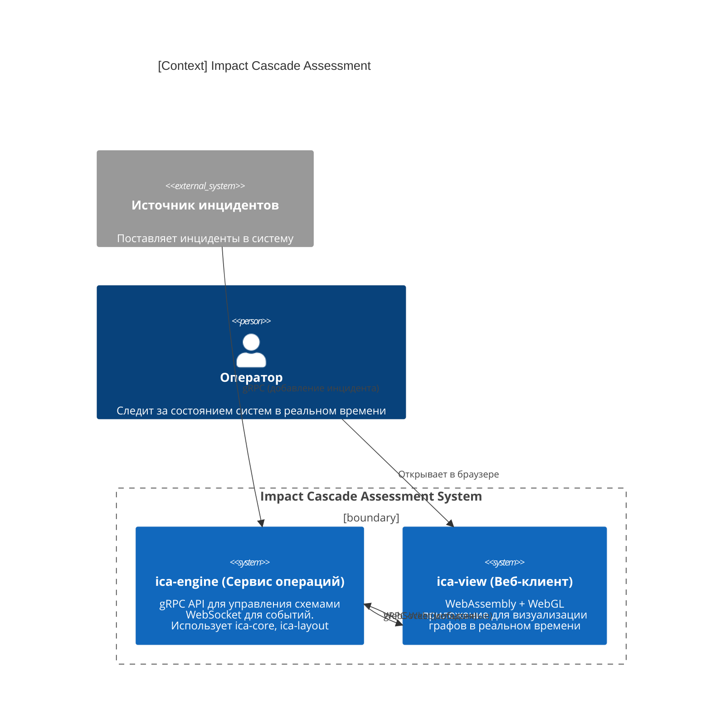
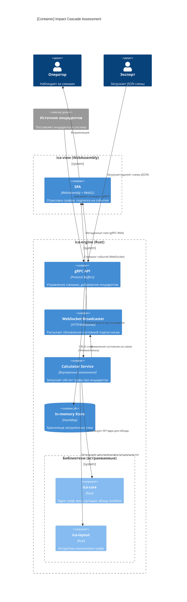
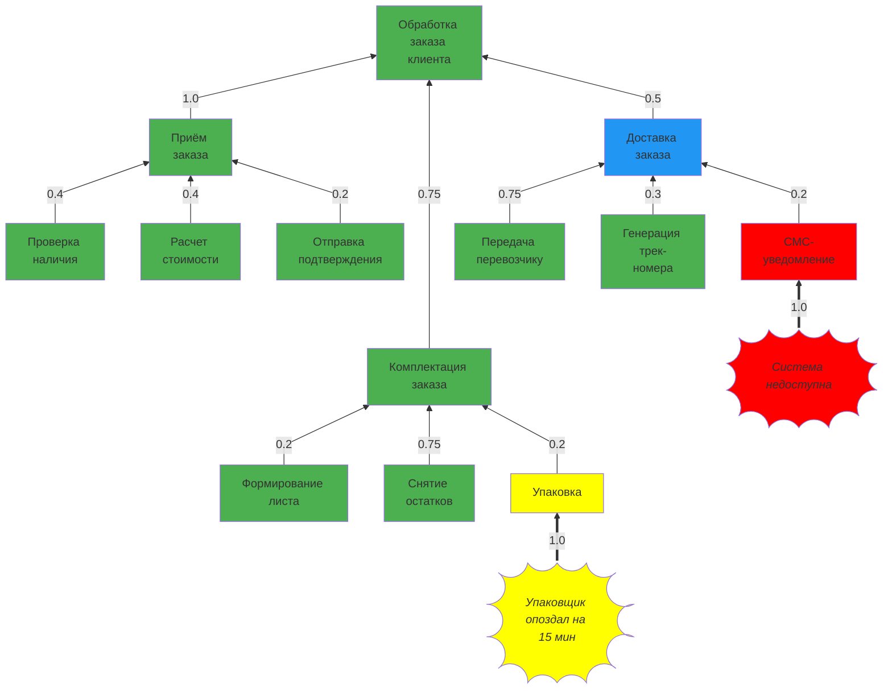

# Impact Cascade Assessment - ICA

# Основные положения

Бизнес-процесс - это устойчивая последовательность взаимосвязанных действий, превращающая ресурсы компании в конкретный ценный результат для клиента. Глубокая декомпозиция процесса позволяет разложить его на элементарные операции, чтобы в режиме реального времени отслеживать "узкие места" и мгновенно воздействовать на проблемный участок, не дожидаясь сбоя всей системы.

Оценка рисков отказов в последовательности подпроцессов позволяет выявить критические точки, где сбой наиболее вероятен или приведет к максимальным потерям. Анализируя взаимосвязи между этапами, можно понять, как остановка одного звена повлияет на всю цепочку, и заранее создать буферные механизмы или дублирующие каналы для сохранения работоспособности бизнес-процесса.

# Цель

ICA предназначена для автоматизированного мониторинга состояния компонентов системы будь то информационная система, бизнес-процесс и т.п.

Общее состояние системы вычисляется на основе значения вероятности отказа всех её компонентов и их степени (вес) влияния по иерархии.

# Состав

Система оценки каскадного влияния (Impact Cascade Assessment)

## ica-core (Библиотека ядра)

Предоставляет программный интерфейс (API) для описания ориентированного графа системы (от зависимых компонентов к корневым).

Позволяет задавать веса (коэффициенты влияния) для ребер графа, определяющие степень влияния состояния дочернего узла на родительский.

Поддерживает динамическую мутацию графа: добавление и удаление узлов и связей в реальном времени.

Содержит механизм регистрации инцидентов (событий сбоя) с заданным уровнем критичности, привязанных к конкретному узлу.

При появлении инцидента запускает алгоритм обхода графа от точки отказа к корням, применяя пользовательскую функцию расчета (callback) к каждому затронутому узлу для пересчета его состояния.

## ica-layout (Библиотека компоновки)

Надстройка над ica-core, реализующая алгоритмы автоматической компоновки (layout) элементов графа.

Предназначена для преобразования логической структуры графа в координаты для последующей визуализации.

## ica-engine (сервис выполнения операций над схемами)

Стек: gRPC-сервер, интегрирующий ica-core и ica-layout.

Управление схемами: Предоставляет методы для загрузки, хранения (in-memory) и удаления графов схем, описываемых в формате JSON.

Обработка событий: Принимает внешние вызовы для добавления инцидентов в конкретную схему, инициируя процесс расчета в ядре.

Коммуникация: После выполнения расчета транслирует события об изменении состояния узлов подписчикам через WebSocket (как основной канал real-time обновлений).

## ica-view (Веб-клиент)

Одностраничное приложение (SPA), скомпилированное в WebAssembly.

Использует WebGL для отрисовки графов схем.

Подключается к ica-grpc по gRPC-Web для получения метаданных и по WebSocket для получения потока событий и отображения изменения состояний узлов в реальном времени.

# Пример

Эксперт декомпозировал процесс `Обработка заказа клиента` и оценил степень влияния подпроцессов на бизнес-процессы верхних уровней.

Ниже иллюстрация бизнес-процесса "Обработка заказа клиента".

В системе отправки СМС произошел сбой - "Система недоступна". Произошёл расчёт состояния узлов бизнес-процесса и был получен следующий результат:

- `СМС-уведомление` отправить не получится - система отказала
- но это не сильно затрагивает процесс верхнего уровня `Доставка заказа`, так как эксперт определил достаточно слабую степень влияния - `0.2`
- состояние процесса `Доставка заказа` ухудшилось, требует внимания
- но это не сильно повлияет на целевой бизнес-процесс `Обработка заказа клиента`.

`Упаковщик опоздал на 15 мин` само по себе малозначащее событие. Оно затрагивает процесс `Упаковка`, но слабо влияет на процесс более высокого уровня `Комплектация заказа`. Поэтому состояние `Комплектация заказа` осталось без изменений.

Вывод: В целом состояние наблюдаемого бизнес-процесса удовлетворительное. Отдельные компоненты (`Комплектация заказа --> Упаковка`, `Доставка заказа --> СМС-уведомление`) требуют внимания.
